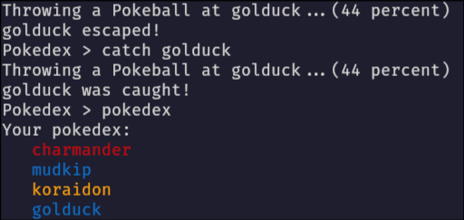
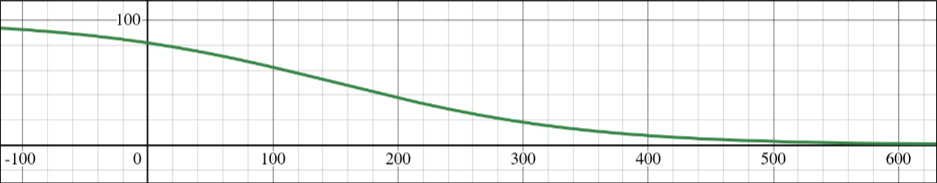

# PokedexCLI

A Command Line Interface built for a [boot.dev](boot.dev) guided
[project](https://www.boot.dev/courses/build-pokedex-cli-golang)
that allows **you** to _explore_ the Pokemon world!



## Installation

```
git clone https://github.com/vilebile17/pokedexcli
cd pokedexcli
go install .
```

Then run the program with:

```
pokedexcli
```

Check the troubleshooting steps [here](https://github.com/bootdotdev/bootdev)
if it says `command not found`

## Additional features

Alongside all of the features that the course suggested, this CLI has a few extra...

1. Colourful text for the `pokedex` command
2. Use of a [sigmoid function](https://en.wikipedia.org/wiki/Sigmoid_function)
to find the probability of a Pokemon being caught.
It's a bit overkill and not very well tuned but I think that it's a bit funny.



(The y-value is the chance that a pokemon is caught and the x-value is the pokemon's base XP)

3. The `help` command has an optional parameter which can be used to
specify a particular command (it is a bit useless though)

4. The `free` command exists to remove a Pokemon from your Pokedex if you really wanted to for some reason
